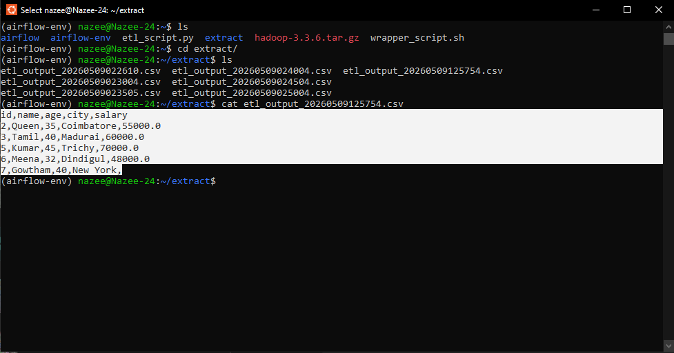
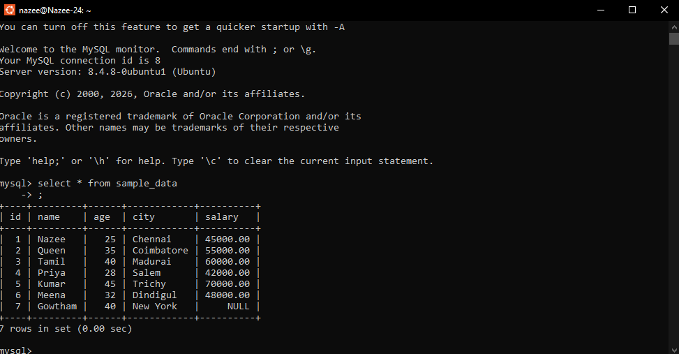
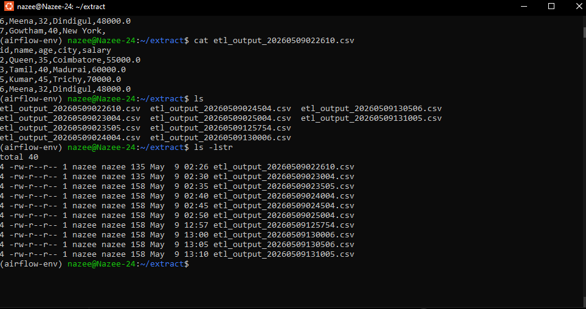

# 🚀 Airflow MySQL ETL Pipeline

## 📌 Project Overview

This project demonstrates an **End-to-End ETL Data Pipeline** built using **Apache Airflow**, **MySQL**, and **Python**.

The pipeline extracts data from a MySQL database, performs transformation, and automatically loads the processed data into CSV files using Airflow scheduling.

---

## 🏗️ Architecture

MySQL Database → Python ETL Script → Bash Wrapper → Apache Airflow DAG → Processed CSV Output

---

## ⚙️ Technologies Used

* Apache Airflow
* Python
* MySQL
* Pandas
* Bash Scripting
* Linux (Ubuntu)
* Git & GitHub

---

## 🔄 ETL Workflow

### 1️⃣ Extract

* Data fetched from MySQL table `sample_data`
* Connection established using `pymysql`

### 2️⃣ Transform

* Filters records where **age > 30**
* Handles missing values automatically

### 3️⃣ Load

* Writes transformed data to timestamped CSV files
* Output stored in `/extract` directory

---

## ⏰ Airflow Automation

* DAG Name: `mysql_etl_dag`
* Schedule: Every 5 minutes
* Operator Used: `BashOperator`
* Executes ETL through wrapper script

---

## 📂 Project Structure

```
airflow-mysql-etl/
│
├── dags/
│   └── mysql_etl_dag.py
│
├── scripts/
│   ├── etl_script.py
│   └── wrapper_script.sh
│
├── output/
│   └── etl_output_*.csv
│
├── requirements.txt
└── README.md
```

---

## ▶️ How to Run

### 1. Start MySQL

Create database and table:

```sql
CREATE DATABASE etl_db;
```

### 2. Install dependencies

```
pip install pandas pymysql apache-airflow
```

### 3. Start Airflow

```
airflow standalone
```

### 4. Enable DAG

Open Airflow UI → Enable `mysql_etl_dag`

---

## 📊 Sample Output

* Automatically generated CSV files
* Timestamp-based naming
* Scheduled execution via Airflow

---

## 🎯 Learning Outcomes

* Workflow Orchestration using Airflow
* ETL Pipeline Development
* Database Integration
* Linux Automation
* Data Engineering Fundamentals

---

## 📸 Screenshots

**Airflow DAG List**


**DAG Graph View**


**ETL Output Terminal**


**MySQL ETL Database**


**Output Files Created**


---

## 👩‍💻 Author

Nazee — Aspiring Data cloud Engineer 🚀

---


